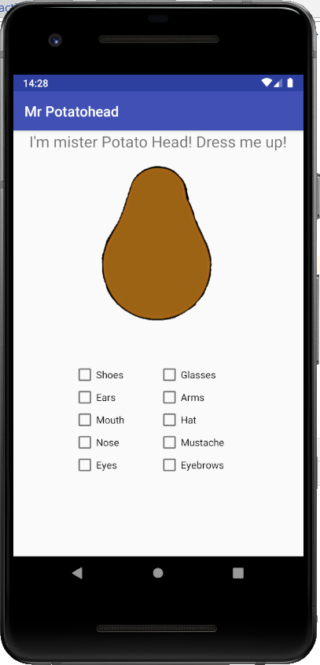
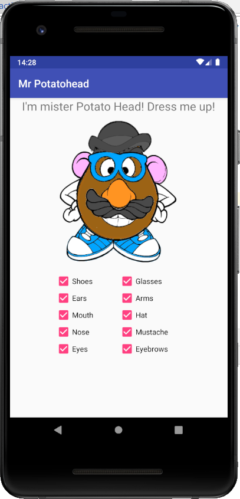
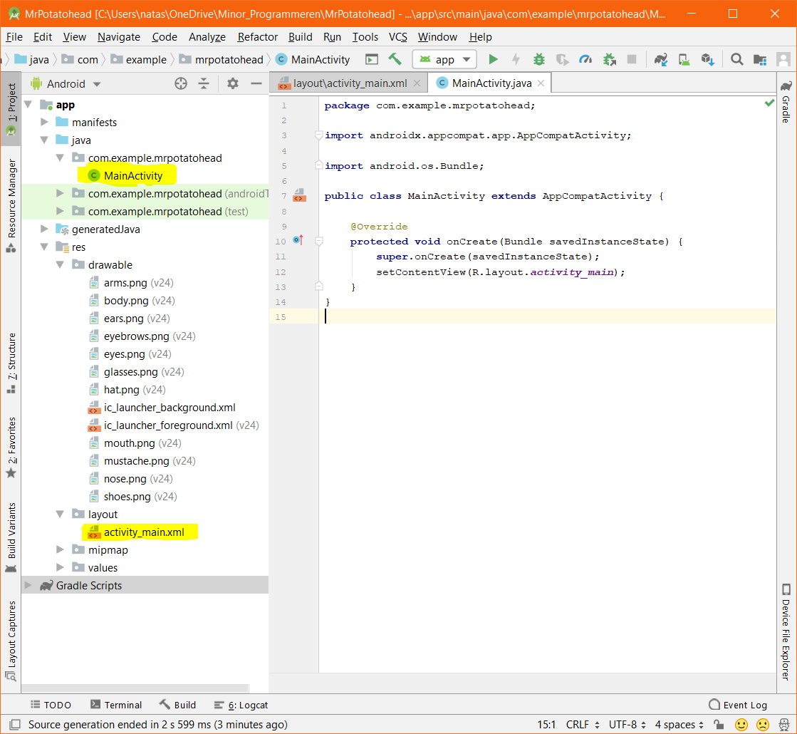
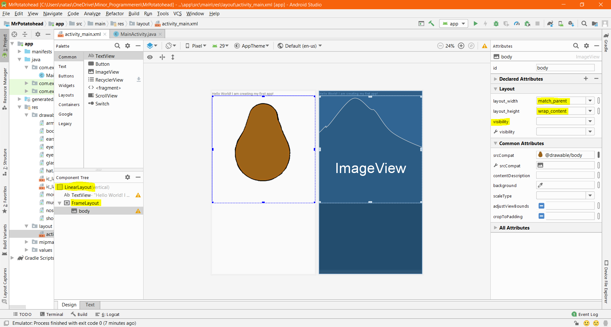
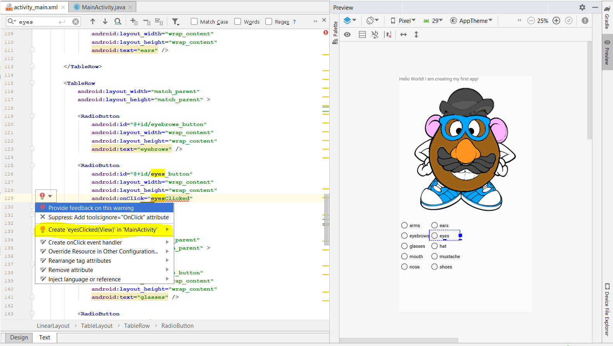
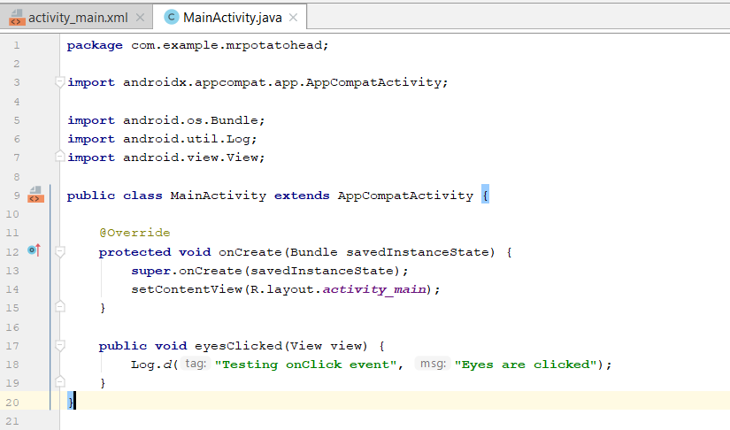

# Mr. Potatohead


## Objectives

- Design your user interface - 5 points
- Write the ```onClick``` methods for your radiobuttons or checkboxes - 5 points
- Make sure the application remembers the way Mr. Potatohead is dressed when the orientation of your phone changes! - 5 points

## Background


Imagine an app that displays a "Mr. Potato Head" toy on the screen. The toy has several accessories and body parts that can be placed on it, such as eyes, nose, mouth, ears, hat, shoes, and so on.

Initially your app should display only the toy's body, but if the user checks/unchecks any of the checkboxes below the toy, the corresponding body part or accessory should appear/disappear.

The way to display the various body parts is to create a separate view for each part, and lay them out so that they are superimposed on top of each other.

(thanks to Victoria Kirst for the original assignment idea and images!)


## Getting started
We have created a project already for you in Android Studio, so you can get started immediately. The project is created for API 15 (IceCreamSandwich). If your phone has an older operating system, please ask for help.

Download the distribution code that can be found in this directory. Start Android Studio, click on "open an existing project", and open the project.

For this project, we'll only work with the two most important files in your Android project: `MainActivity.java`, which contains the back-end code for your main screen; and `activity_main.xml`, which contains the definition of what the main screen looks like. You'll find them in the **project browser**:




## Creating the user interface

Let's design the interface. 

1.  Double-click `activity_main.xml` in the project browser to open it. 

2.  Your layout currently contains a `Label` with the text `Hello World! I am creating my first app!`. Under this, in a horizontal linear layout, it contains a `FrameLayout`. This type of layout is perfect for stacking our potato images on top of each other.

We'll use the Palette to design the layout, as can be seen in the following screenshot:


3.  Select the "Layouts" category and drag a `TableLayout` to the screen. That one nicely fits the idea of presenting a grid of checkboxes. It already contains a couple of `TableRow` items, but feel free to play with this a bit to show the buttons as you'd like!

    > Note that the activity already contained a `LinearLayout`. Now you've added to different types of layout *into* that top-level layout.

4.  Roughly position both layouts like they are in the picture above. Later, we'll add constraints for automatically positioning them on different screen sizes.

5.  Drag an `ImageView` from the Palette to the `FrameLayout`. Immediately, a dialog pops up, allowing you to choose one of the `.png` files that you just added to the project. We have already added the body for you.

6.  Make sure all the images are the same size and positioned right on top of each other. Currently, you can see all of them, but we'll make sure they are invisible when the app starts. For each of the images (except the body, of course!), set the `visibility` attribute to `invisible`. It is probably listed under "favorite attributes", but if you can't find it, choose the blue link "View all attributes" all the way down the Attributes sidebar.
       
    > Tip: because all images are supposed to be on top of each other, it's hard to select individual items. In that case, you can use the component tree to select the image views. You can even select multiple views and set the attributes for all of them.

7.  Now it's time to add checkboxes. Drag them from the Palette to the `TableLayout` and set their `text` to reflect the body parts that are present in the images. Be sure to check that they are actually *in* the `TableLayout`. 

8. You can now try to run the application on your phone, by clicking the green start button and following the steps! For this you need a data cable. Make sure that the Developer Options on your phone are on. Do you not have a cable, or does this not work? Maybe you can set up an Emulator - ask for help.

## Connecting everything with code
First, some final setup. Checkboxes can *do* something when tapped on the phone. In Android, even without programming something, they can be checked on and off visually, but that is not particularly useful if there is no further behaviour attached. 

Select one of those checkboxes, and in the attributes sidebar find the `onClick` attribute. This attribute allows you to attach a method to a view (in this case a checkbox) which you can then use to program specific behaviour that should be executed when someone clicks on it. Select the `onClick` attribute, and enter `checkClicked` as its value: this is the name of the method that will be called whenever someone selects or unselects the checkbox. Do this for each of the checkboxes. This will give a warning: the method you specify, does not exist yet! Click on the "text" tab that is on the bottom of your screen, and create the corresponding method! When you click this, Android Studio will take you to the `MainActivity`.



All the checkboxes are now connected to a `checkClicked` method, which we will use to make our program actually do something when someone checks one of them! 

> In Android, there is a separation between the layout files and the program logic. The layout files, which are of the `xml` format are not where you write your actual program. They are a mostly static representation of what the app should look like. In the activities, which are `.java` files, you will actually write code that affects the app's run time behaviour.  

1.  Now if you haven't switched yet, switch to the code, by double-clicking `MainActivity` in the Java folder in the project browser.

2. In one of the methods, create a Log message like this:


3.  Now try your app! Run it on your phone or in the simulator. Your app should log something whenever you click one of the checkboxes. If not, ask for help!

Finally, we need to be able to switch some of the images on and off, depending on the state of the checkboxes. 

4.  To set the visibility, you will need a reference to the image view that you would like to manipulate. Here's a sample:

        ImageView image = (ImageView) findViewById(R.id.arms);

    The idea (no pun intended) of `findViewById()` is that you specify the **R**esource id of your image view. When running on the phone, the Android system will then find it for you on the screen and provide you with a reference.
    
    What ID should you provide? This depends on the name that you have set for the view. Currently, your imageviews may have uninformative names such as `imageView2`. Best to head to the layout designer, click each of the image views, and set an appropriate id in the attributes sidebar. Tip: use the component tree to select each of the views.

5.  As soon as you have a reference to one of the images, you can set whether or not it (or any other control) is visible on the screen by calling its `setVisibility()` method. The `setVisibility` method accepts a parameter such as `View.VISIBLE` or `View.INVISIBLE`. There is also a `getVisibility()` method if you need to check whether a widget is currently visible.

There's only a little bit of Java code to write, in order to have each checkbox show and hide the corresponding image. Because we use lots of separate images, expect your code to be slightly inefficient in terms of lines of code! It's up to you how to handle each of the cases. Start simple though! It is fine to have a working solution that is slightly inefficient first and improve from there. 

## Memory management

There's a bug in your app! Because of how Android works, your layout may be reloaded whenever you leave your app, switch to another app, and then return. This way, memory usage can be kept low. Your layout may also be reloaded as the phone is rotated. However, even though your checkboxes will be automatically reloaded in the same state as you left them (checked/unchecked), your image views will not!

You can preserve this state by using the `onSaveInstanceState()` method. It is a method that you can optionally override in your activity. 

    public void onSaveInstanceState(Bundle outState) {
        super.onSaveInstanceState(outState); // always call super
        outState.putInt("name", value);
        outState.putString("name", value);
        ...
    }

You can use the `Bundle` to save items. This same bundle will be delivered to you when the layout is reloaded. Actually, that bundle was already in your activity! It is a parameter to the `onCreate()` method. So in `onCreate()`, you can use some methods to **restore** the state of your views:

    ... = savedInstanceState.getInt("name");
    ... = savedInstanceState.getString("name");

Now, your task is to save the `visibility` state of all `ImageViews`. Which get/put method seems appropriate to do this? Google "android bundle" to get a list of all get/put methods.


## Some ideas for extras

You may have some time left to make your app a bit better. Here are a few ideas that you can work on:

- Phones can also be rotated to landscape mode. Currently, our layout doesn't work too well for this mode. Mr. Potatohad should probably be to the left and the checkboxes to the right. You can use two layouts for portrait and landscape, respectively, to fix this. In the layout editor, choose "Add landscape layout" to get started.

- Think about how you can make the code for `checkboxClicked()` as tiny as possible, even when handling such a large a mount of checkboxes. Read the next section for more about this :).

## Another method: Handling all click events with óne method
You can also try another way to connect all the checkboxes, which could be more efficient. For this, you need to give all the `onClick` attributes of the checkboxes the same name. 

Now, every single checkbox is connected to the same method. How do we figure out which one it is? We only have a single clue: the parameter `View v`. This parameter is a **reference** to our checkbox view on the screen (the one that was clicked). However, this parameter is of type `View`, not of type `CheckBox`. It is common (and sometimes needed) to convert this parameter before doing anything else with it.

1.  To access all methods from the `CheckBox` class, we have to cast the parameter. Create a temporary variable to hold the `CheckBox`:

        CheckBox checkbox = (CheckBox) v;

    As you might remember, putting a type between rounded brackets will **cast** something to that type (if possible!).
    
    > The important part: we are absolutely sure that we connected the `checkClicked()` method only to checkboxes, so this is a safe thing to do! We may *assume* that the thing in `v` is a `CheckBox`.

2.  Now that we have a variable of type CheckBox, we can call the method `getText()` on it. Remember from the layout that you set the `text` property of each checkbox? This is the same.

3.  To get the text of a checkbox as a simple `String`, call `checkbox.getText().toString()`. That's it! Oh, and to find out if the checkbox is checked or not, use the `isChecked()` method.
