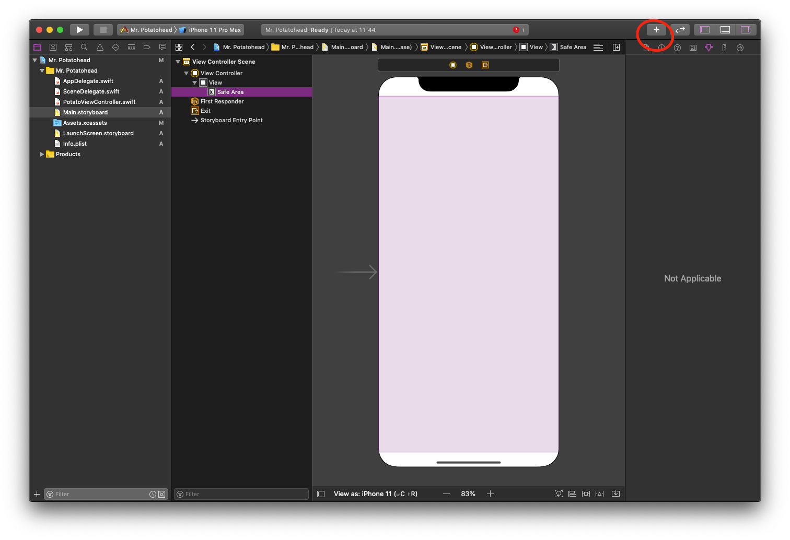

# iOS: Mr. Potatohead

## Objectives

- Create a first app!
- Practice with Git.
- Use layouts to design your user interface.

## Background

Imagine an app that displays a "Mr. Potato Head" toy on the screen. The toy has several accessories and body parts that can be placed on it, such as eyes, nose, mouth, ears, hat, shoes, and so on.

Initially your app should display only the toy's body, but if the user checks/unchecks any of the checkboxes below the toy, the corresponding body part or accessory should appear/disappear.

The way to display the various body parts is to create a separate view for each part, and lay them out so that they are superimposed on top of each other.

(thanks to Victoria Kirst for the original assignment idea and images!)

## Getting started 

Because of the short time limit, you'll start out with a partly set up Xcode project. Go to [this git repository](https://github.com/mprog-apps/mr-potatohead-ios) and fork it. Next, clone this repository onto your computer. 

Go the the newly cloned repository on your computer and have a look around. You'll notice that there is a `Mr. Potatohead` folder, a file called `Mr. Potatohead.xcodeproj`, and a README.md. The `Mr. Potatohead.xcodeproj` file is the file that contains your project. Go ahead and open this file. If everything goes to plan this should open the Mr. Potatohead project in Xcode.  

The `PotatoViewController.swift` is the file that will hold the code that makes the app behave like you want it to. This is the file where you'll be writing code. 

The `PotatoViewController.swift` file is a file corresponding to a `ViewController`: a file that controls what a user will see (view) on their phone screen. You can create the layout of the app in the `Main.storyboard`. Click on `Main.storyboard` now. You'll see that there is already an image of a potato and a single switch button in the view. It's your job to finish the rest of the app.  

Now, let's get started! 

## Layout 

First, we want to get our user interface looking like it should. We've already placed the body and a single switch for you and connected it to the code, but the rest of the images and switches and labels you're going to have to add yourself. You can add an image by adding an ImageView. You can do this by:

1. Click on the `+` at the top right corner in the `Main.storyboard`. 

2. Use the search bar to search for an ImageView. 
3. Drag the ImageView to the phone screen.
4. Click on the ImageView you just added and on the right hand side of the screen, go to the `Attributes Inspector` and set the image of the ImageView to the image you want to display. 

In order to be able to control the images and switches with code, we need to connect it to the PotatoViewController file. You can do this in the following way:

1. Click on "add editor to right" on the top right side of the screen. 
2. Click on the  symbol at the top left of the screen that just popped up. 
3. Go to "Automatic" and select the `PotatoViewController`. You should now see the code that is in the ViewController
4. Next, click on the on the image/label/switch. Press control and drag towards the code. 
5. Now you'll want to make sure the connection is set to Outlet, the object is set to the PotatoViewController. You can leave the other options be for now. 

When you want to create actions for the switches, follow the above steps but set the connection to Action instead of Outlet. 